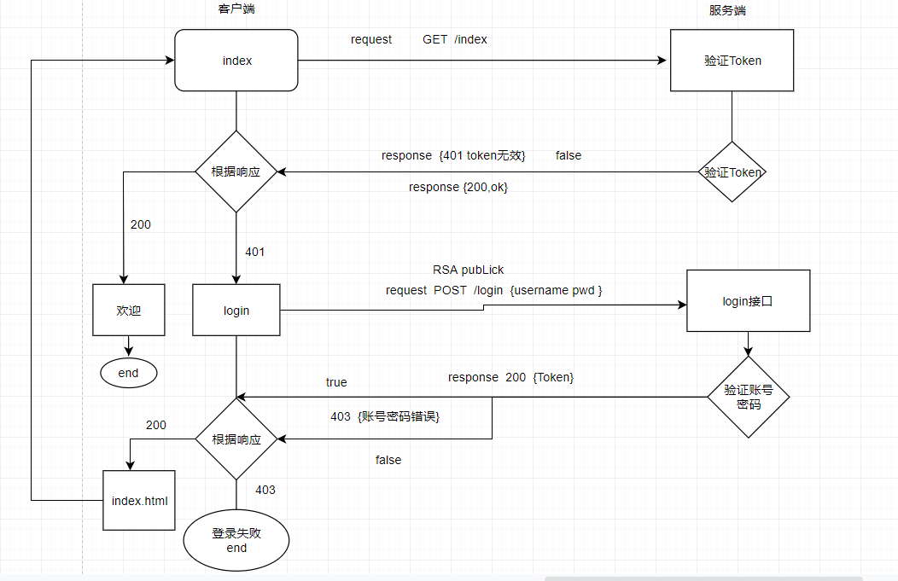

# express 注册登录案例

>  实现 **前后端分离**的注册登录案例, 实现 **RSA加密** **jwt-Token验证** **前端后端数据校验**

# server 服务端

### 接口

- 登录 login POST
- 注册 register POST
- 公钥获取 getPublicKey GET

### 模块

- User管理模块 ['添加','查询','验证']
- Key管理模块 ['生成秘钥','获取公钥','加密','解密'] 
- jsonwebtoken ['创建Token']
- validate 内容校验模块 ['账号格式','密码格式','长度','必填','返回语']
- statusCode管理 自定义状态码 ['账号或密码错误','Token错误','Token失效','账号已存在','账号格式不正确','密码格式不正确','登录成功','注册成功']

### 中间件

- CORS 跨域 携带 Cookie
- express-JWT 验证Token


## client 客户端

### UI 

layerUI 


### 库

jQuery  axios  jsencrypt 


### 页面

login.html

index.html


### 业务流程




### token

PAYLOAD:DATA

```
{
  "exp": ~~((Date.now() / 1000) + 24 * 3600 * 3), //过期时间
  "user_name": "kyogre", //用户名
  "user_id":"000000", //用户ID
  "iat": ~~(Date.now() / 1000), //签发时间
}
```

